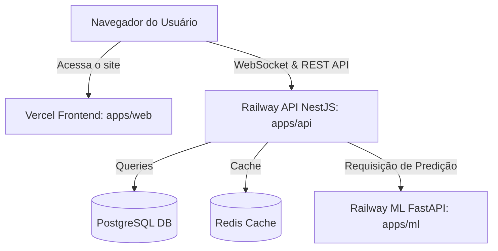

# Guia de Implantação (Deployment Guide)

Este repositório é um monorepo que contém três serviços principais:
1. **Frontend (Next.js)** em `apps/web`
2. **API Backend (NestJS)** em `apps/api`
3. **Serviço de ML (Python/FastAPI)** em `apps/ml`

Abaixo estão as instruções passo a passo para implantar cada um desses serviços em produção.

---

## 1. Frontend (Next.js) na Vercel

A Vercel é a plataforma ideal para hospedar o frontend da aplicação (`apps/web`). Ela oferece suporte nativo a monorepos e Next.js.

### Passo 1: Conectar o Repositório à Vercel
1. Vá para o painel da [Vercel](https://vercel.com/) e clique em **Add New...** > **Project**.
2. Importe o repositório do seu GitHub/GitLab.

### Passo 2: Configurar o Projeto Monorepo
Ao configurar o projeto, defina as seguintes opções:
- **Project Name**: `rec-flight-intelligence-web` (ou o nome que preferir)
- **Framework Preset**: `Next.js`
- **Root Directory**: `apps/web`
- **Build & Development Settings**:
  - *Deixe as opções padrões*, pois o preset do Next.js identificará automaticamente os comandos correctos.
  - O comando executado será `pnpm build`.

### Passo 3: Configurar as Variáveis de Ambiente
Na seção **Environment Variables**, adicione as seguintes variáveis:
- `NEXT_PUBLIC_API_URL`: A URL pública de produção da sua API NestJS (exemplo: `https://rec-flight-api.up.railway.app`). **Nota: Sem barra (`/`) no final.**
- `NEXT_PUBLIC_API_WS_URL`: A URL do WebSocket da sua API NestJS (geralmente idêntica à URL da API, ex: `https://rec-flight-api.up.railway.app`).

Clique em **Deploy**. A Vercel fará o build e fornecerá um domínio de produção gratuito (ex: `https://rec-flight-intelligence-web.vercel.app`).

---

## 2. API Backend (NestJS) + PostgreSQL + Redis (Recomendado: Railway ou Render)

A API NestJS usa WebSockets (`socket.io`) para atualizações em tempo real, além de conexões persistentes com o banco de dados PostgreSQL e cache com o Redis. Como funções Serverless da Vercel não suportam conexões persistentes WebSocket e têm limites de tempo de execução, **o backend precisa ser hospedado em um provedor de servidores dedicados (PaaS), como o Railway ou Render**.

Abaixo está o guia usando o **Railway** (que é o mais simples para monorepos com múltiplos serviços):

### Passo 1: Criar Banco de Dados PostgreSQL e Redis no Railway
1. No painel do [Railway](https://railway.app/), crie um novo projeto (**New Project**).
2. Adicione um banco de dados PostgreSQL (**Provision PostgreSQL**).
3. Adicione um Redis (**Provision Redis**).

### Passo 2: Criar o Serviço da API
1. Clique em **New** > **GitHub Repo** e selecione o seu repositório.
2. Nas configurações do serviço criado para a API, configure:
   - **Root Directory**: `apps/api`
   - **Build Command**: `pnpm build && pnpm --filter api exec prisma db push`
   - **Start Command**: `node dist/src/main`

### Passo 3: Configurar Variáveis de Ambiente da API
No Railway (ou no seu provedor de escolha), adicione as seguintes variáveis de ambiente:
- `DATABASE_URL`: Conecte com o banco de dados. No Railway, você pode usar a variável mágica `${{Postgres.DATABASE_URL}}` ou copiar a URL de conexão do banco criado.
- `REDIS_URL`: Conecte com o Redis. No Railway, você pode usar `${{Redis.REDIS_URL}}`.
- `PORT`: Deixe a plataforma gerenciar isso automaticamente. O NestJS já está configurado para ler `process.env.PORT || 3001`.
- `ML_SERVICE_URL`: URL do serviço de Machine Learning (veja a seção 3 abaixo). Exemplo: `https://rec-flight-ml.up.railway.app`.
- *(Opcional)* `OPENSKY_USERNAME` e `OPENSKY_PASSWORD`: Seus dados de acesso à API OpenSky para consulta de voos reais.

---

## 3. Serviço de Machine Learning (Python/FastAPI)

Este serviço hospeda o modelo de predição de atrasos em Python e FastAPI. Ele pode ser executado facilmente no Railway ou no Render usando o **Dockerfile** já presente na pasta `apps/ml`.

### Passo 1: Criar o Serviço de ML
1. No mesmo projeto do Railway, clique em **New** > **GitHub Repo** e selecione o mesmo repositório.
2. Nas configurações do serviço criado para o ML:
   - **Root Directory**: `apps/ml`
   - A plataforma detectará automaticamente o `Dockerfile` dentro desta pasta e fará o build usando ele.

### Passo 2: Copiar URL para a API
1. Após a implantação do serviço de ML, gere um domínio público para ele (ex: `https://rec-flight-ml.up.railway.app`).
2. Copie essa URL gerada e coloque-a na variável de ambiente `ML_SERVICE_URL` da sua **API NestJS** (passo 2 do backend).

---

## Fluxo de Comunicação em Produção

Dessa forma, seu sistema estará 100% integrado em produção com alto desempenho!
